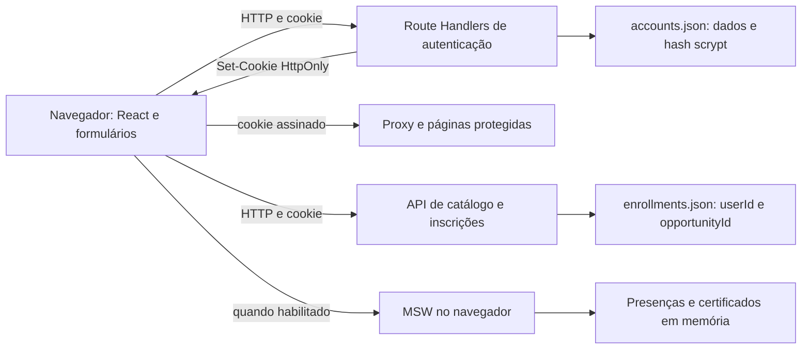

# Auditoria de segurança — correções e revalidação

Data: 7 de outubro de 2026. Base atualizada por `git pull --ff-only origin main`:
`a1f5edf3b0db013fccf8d0ee30afa315f92cc1c1`. Correções na branch
`fix/corrigir-auditoria`.

## Resumo executivo atual

Os seis achados de segurança da auditoria inicial foram corrigidos no escopo do adaptador
local de uma única instância. A conta embutida foi desativada, sessões passam a ser revogáveis,
mutações verificam origem, gestão exige papel no servidor, autenticação limita corpo/tentativas
e cadastro não revela diretamente e-mails existentes. Os cinco achados funcionais também
foram tratados; CR-03 já veio corrigido no pull e foi revalidado.

Isso não implementa o backend Spring/PostgreSQL previsto. Gestão/emissão real e upload de
certificados no servidor continuam sem integração e estão explicitamente indisponíveis fora
da demonstração. Não foi atribuída proteção de backend a controles de React, Zustand ou MSW.

## Situação dos achados e evidência atual

Severidade e confiança abaixo correspondem ao achado original; o status atual é **corrigido**
no escopo indicado. Causa, pré-condições, impacto e evidência anterior permanecem no registro
histórico, com linhas relativas à base inicial.

| ID | Severidade / confiança | Correção e localização atual | Regressão confirmada |
| --- | --- | --- | --- |
| SEC-01 | Alta / alta | Autenticação só consulta contas persistidas: `src/features/auth/services/accounts.ts:67`. Credenciais foram retiradas do módulo legado e de AUTH.md; tokens antigos são incompatíveis com `src/features/auth/schemas/session-schema.ts:12`. | `tests/security.test.ts:120`: token antigo assinado é recusado; conta inexistente não entra. HTTP H03 confirma login apenas de conta criada e papel fixo. |
| SEC-02 | Média / alta | Origem canônica e Fetch Metadata: `src/lib/server/request-security.ts:13` e `:30`; JSON obrigatório em `:64`. Aplicado em login, cadastro, logout, inscrição e APIs de gestão. | `tests/security.test.ts:65` e `:77`; HTTP H02/H04; navegador B05/B06: formulários text/plain cross-site e entre portas recebem recusa, sem troca de conta/inscrição. |
| SEC-03 | Média / alta | Sessões aleatórias persistidas, consulta da conta atual e revogação: `src/features/auth/services/session.ts:58`, `:112`, `:125`; logout revoga antes de expirar cookie. | `tests/security.test.ts:106` e `:129`; HTTP H07: token copiado perde acesso à sessão/inscrição, outra sessão continua válida; navegador B07 confirma logout pela UI. |
| SEC-04 | Média / alta | Proxy, página e APIs exigem papel: `src/proxy.ts:8`, `src/features/auth/services/server-session.ts:22`, `src/features/organizations/services/server-authorization.ts:7`. Mocks verificam sessão/papel e separam estado por conta. | `tests/security.test.ts:150` e `:233`; HTTP H05: visitante 401, voluntário 403 nas APIs e redirecionamento na página. Navegador B03 e D04 confirmam controles nos dois modos. |
| SEC-05 | Média / alta | 8192 bytes, prazo de leitura 5s, orçamento agregado 30/min, 10 tentativas/e-mail/15min: `src/lib/server/request-security.ts:40`, `:62`; scrypt com máximo de duas derivações simultâneas: `src/features/auth/services/accounts.ts:29`. | `tests/security.test.ts:77`, `:91`, `:182`, `:192`, `:201`; HTTP H02/H08: corpo grande 413 e tentativas excedentes 429 com Retry-After. Não foi feito stress test. |
| SEC-06 | Baixa / alta | Novo/duplicado respondem 202, mesmo corpo e nenhum cookie: `src/app/api/auth/register/route.ts:16`. UI pede login posterior. Ambos executam scrypt; login inexistente também deriva hash. | `tests/security.test.ts:47`; HTTP H01; navegador B01 confirma resultado uniforme e ausência de sessão automática. Não se afirma igualdade absoluta de tempo. |

Não há um endpoint público para conceder papel de organização. APIs de gestão retornam
`501` para organização autenticada enquanto o backend não existe; elas não alteram dados reais.
Nos mocks, fixtures ficam separadas por ID de conta e presença encerra depois do despacho.
Ver [CODE_REVIEW.md](CODE_REVIEW.md) para o fechamento dos achados funcionais.

## Fluxo real após as correções

1. Cadastro: origem → orçamento agregado → JSON limitado → Zod → limite por e-mail → scrypt →
   persistência de voluntário ou duplicidade interna → resposta uniforme, sem sessão.
2. Login: mesmos controles de entrada → conta persistida → scrypt → ID aleatório/HMAC →
   registro em `sessions.json` → cookie HttpOnly/SameSite/Secure conforme origem canônica.
3. Sessão: token limitado → assinatura/tempos/schema → registro persistido correspondente →
   identidade e papel atuais de `accounts.json`. Token sem registro ou conta é recusado.
4. Logout: origem → registro revogado → cookie expirado. APIs e páginas reconsultam a sessão.
5. Inscrição: origem → sessão válida → proprietário derivado do servidor → duplicidade/vagas →
   gravação. O painel lê somente as inscrições desse proprietário.
6. Gestão: sessão + papel no Proxy/página/APIs. Sem integração real, APIs não executam operações;
   simulação MSW exige opt-in em produção e usa cópias de fixtures por conta.
7. Certificados: demonstração guarda registros/arquivos em IndexedDB e verifica sessão/owner no
   contrato simulado. Fora dela, UI não envia/lista documentos sem integração. Horas pendentes
   não incrementam o banco de horas.

## Verificações realizadas nas correções

- `pnpm test`: **14 testes de regressão**, com Node.js 24, dados/chave temporários e sem serviços
  externos. Runner usa TypeScript já instalado e node:test; não adiciona dependências.
- **8 cenários HTTP** no build real, **7 cenários de navegador** no build sem mocks e
  **4 cenários de navegador** no build com `NEXT_PUBLIC_API_MOCKING=enabled`, todos aprovados.
- Demonstração revalidada: formulário salva documento, histórico/download sobrevivem a reload,
  outra conta não lista nem baixa o comprovante, logout impede leitura e declaração não gera horas.
- `pnpm lint`, `pnpm exec tsc --noEmit` e `pnpm build` aprovados; build de demonstração também
  aprovado. Tipos obsoletos de uma rota removida em `.next/dev/types` foram preservados em
  backup temporário e regenerados, sem modificar fonte para silenciar erros.
- Testes foram adicionados à CI e a `pnpm check`. Não houve instalação ou mudança
  de dependências/lockfile, alteração das contas existentes ou teste em ambiente externo.
- Os scripts HTTP/Chrome e evidências sem valores sensíveis estão em
  `/tmp/portal-security-audit/fix-*-results.json`; a suíte persistente está em `tests/security.test.ts`.
  Os scripts locais de navegador/HTTP são evidência complementar, não uma suíte de CI.

## Plano de implantação e limites restantes

| Prioridade | Ação | Situação |
| --- | --- | --- |
| P0 | Remover login embutido e invalidar tokens antigos | Implementado; usuários precisam entrar novamente. |
| P1 | CSRF, revogação, autorização, limites de entrada/abuso e cadastro uniforme | Implementado e revalidado no adaptador local. |
| P1 | Configurar `PORTAL_ORIGIN` e `SESSION_SECRET` no ambiente que executar produção | Requisito operacional: HTTPS externo sem caminho; ausência de origem bloqueia mutações com 503. Segredo real não foi alterado nem divulgado. |
| Antes de várias instâncias/usuários reais | Banco transacional, sessões e rate limiting compartilhados; limites de entrada no ingress | Recomendação preventiva. Arquivos e contadores por processo não oferecem garantias distribuídas. O orçamento agregado local é conservador e pode bloquear usuários legítimos durante abuso. |
| Antes de integrar gestão/upload | RBAC/tenant no backend, aprovação/emissão persistente, validação real de arquivo, armazenamento privado | Integração ausente, explicitamente indisponível no modo real; não tratada como vulnerabilidade explorável de um backend inexistente. |
| Manutenção | SCA atualizado e revisão dos advisories por alcançabilidade; revisão de headers conforme hospedagem | Recomendações da auditoria inicial. Nenhuma nova CVE foi confirmada nem dependência alterada. |

A revisão original de dependências e segredos continua sendo uma triagem delimitada, não uma
certificação de produção ou prova de ausência de todas as vulnerabilidades. Consulte
[docs/AUTH.md](docs/AUTH.md) e [docs/DEMO.md](docs/DEMO.md) para configuração e compatibilidade.

---

## Registro histórico da auditoria inicial

**A partir daqui, descrições, linhas, testes e plano se referem exclusivamente à base
`bf188428d8e451dda5f7cc083224dc004d277410`, anterior ao pull e às correções.
Os status atuais estão acima; os achados abaixo não permanecem abertos por este registro.**
# Auditoria de segurança — Portal Voluntário

Data: 7 de outubro de 2026. Base auditada: `bf188428d8e451dda5f7cc083224dc004d277410`.

## Resumo executivo

Foram identificados **seis achados de segurança: um alto, quatro médios e um baixo**. Não foi confirmada vulnerabilidade crítica. A aplicação não deve ser considerada pronta para autenticar usuários reais em produção enquanto aceitar as credenciais públicas da conta de demonstração, permitir login CSRF e conservar a validade de sessões copiadas depois do logout.

O servidor verifica corretamente a assinatura e a expiração do cookie antes de inscrever um usuário. Não foi confirmado IDOR nesse fluxo: a identidade vem do cookie, e o catálogo devolve apenas as inscrições da identidade autenticada. Alterar `role` no cadastro ou enviar o ID de outra pessoa no corpo da inscrição não contornou esses controles.

Há uma falha de autorização em `/organizacao`: voluntários conseguem abrir a tela de gestão. O impacto atual deve ser delimitado: leitura de participantes, alteração de presença, despacho de certificados e submissão de documentos são implementados somente em mocks. Os endpoints correspondentes retornaram `404` no servidor real. Não há evidência de acesso a participantes reais de outras organizações, emissão real de certificados ou escalonamento para administrador.

| ID | Severidade | Confiança | Situação | Achado |
| --- | --- | --- | --- | --- |
| SEC-01 | Alta | Alta | Confirmado no build de produção | Credenciais públicas de demonstração criam sessão real |
| SEC-02 | Média | Alta | Confirmado em navegador | Login CSRF; mutações também não verificam origem |
| SEC-03 | Média | Alta | Confirmado por HTTP | Logout não revoga o token copiado |
| SEC-04 | Média | Alta | Rota confirmada; mutações limitadas ao mock | Voluntário acessa gestão de organizações |
| SEC-05 | Média | Alta para ausência de controles | Confirmado no servidor local; indisponibilidade não testada | Autenticação sem limitação de tentativas e orçamento de corpo |
| SEC-06 | Baixa | Alta | Confirmado por HTTP | Cadastro revela a existência de contas |

Os cinco problemas funcionais estão detalhados em [CODE_REVIEW.md](CODE_REVIEW.md). A escala considera o impacto demonstrado nesta implementação; riscos de funcionalidades ainda inexistentes ficam separados como recomendações.

## Escopo, método e limites

- Foi aplicada a skill `security-code-audit`, incluindo seus guias de rastreamento, classes de vulnerabilidade e relatório. `code-security` e `code-review` não foram encontradas nas skills instaladas; a revisão equivalente foi realizada com leitura do código e testes locais.
- Foram lidos `README.md`, `AGENTS.md`, `docs/AUTH.md`, `docs/DEMO.md`, a proposta acadêmica, configurações, workflow, manifestos, lockfile e código das rotas, serviços, schemas, componentes e mocks. Foram consultados os guias locais de autenticação, segurança de dados, Proxy e Route Handlers em `node_modules/next/dist/docs/`.
- A base local de `main` e `origin/main` apontava para o mesmo commit. A branch `docs/auditoria-seguranca` foi criada dessa base para os relatórios, sem consultar o remoto e sem commits.
- Testes HTTP e de navegador atingiram somente loopback. A instância usou `PORTAL_DATA_DIR` em `/tmp/portal-security-audit/http-data` e uma chave aleatória de teste; os dados existentes em `.local-data` não foram usados. Testes unitários usaram diretórios temporários próprios.
- Não houve instalação de dependências, alteração de código de produção, teste de carga, destruição de dados ou uso de credenciais contra serviço externo. As credenciais de demonstração foram verificadas exclusivamente no servidor local isolado.
- Consultas externas se limitaram a documentação e advisories públicos dos mantenedores, para verificar versões e evitar atribuir CVEs incorretamente. Não houve sondagem de ambientes externos nem envio do lockfile a um scanner remoto.
- Não estão disponíveis o backend Spring, banco PostgreSQL, infraestrutura de hospedagem, configuração de ingress/proxy, sessões de produção ou base de usuários reais. A auditoria não afirma propriedades de sistemas ausentes.
- A revisão de dependências inclui inventário completo do lock e triagem dirigida de advisories relevantes. Não substitui uma consulta exaustiva e atualizada de SCA para todos os 701 pacotes.

## Arquitetura e fronteiras de confiança

O projeto é um frontend Next.js App Router que também implementa um backend local de contas e inscrições. A proposta prevê Spring Boot/PostgreSQL e RBAC de estudantes, organizadores e administradores; essas partes não estão presentes neste repositório. O modelo atual aceita somente `volunteer` e `organization`, e o cadastro sempre cria `volunteer`.

Os ativos relevantes são a identidade do usuário, a chave de assinatura, hashes de senha, nomes/e-mails, inscrições e disponibilidade de vagas. Os atores considerados são visitante, voluntário, organização, pessoa com token copiado e atacante que controla uma origem externa ou uma origem do mesmo site. As fronteiras críticas são navegador/servidor, usuário/usuário, voluntário/organização e demonstração/persistência real.

### Mapa de rotas e operações

| Superfície | Implementação | Controles e efeito real |
| --- | --- | --- |
| `/` | `src/app/page.tsx` | Pública; conteúdo institucional |
| `/entrar`, `/criar-conta` | Páginas e formulários da feature auth | Públicas; `next` validado; chamadas às APIs reais |
| `/oportunidades` | `src/app/oportunidades/page.tsx` | Pública; usuário opcional verificado no servidor |
| `/painel` | `src/app/painel/page.tsx:5` | Proxy e `requireAuthenticatedUser`; dados de progresso são fixtures |
| `/organizacao` | `src/app/organizacao/page.tsx:5` | Autenticação, sem autorização por papel |
| `POST /api/auth/register` | `src/app/api/auth/register/route.ts:7` | Zod; scrypt; persistência; cookie real; não verifica origem |
| `POST /api/auth/login` | `src/app/api/auth/login/route.ts:8` | Zod; credenciais locais ou demo; cookie real; não verifica origem |
| `GET /api/auth/session` | `src/app/api/auth/session/route.ts:6` | Verificação HMAC/tempo; DTO público; `no-store` |
| `POST /api/auth/logout` | `src/app/api/auth/logout/route.ts:5` | Expira cookie; não invalida token no servidor |
| `GET /api/opportunities` | `src/app/api/opportunities/route.ts:7` | Catálogo público; filtra inscrições pelo usuário; `no-store` |
| `POST /api/opportunities/:id/registrations` | `src/app/api/opportunities/[id]/registrations/route.ts:6` | Cookie obrigatório; identidade derivada da sessão; duplicidade e vagas no servidor |
| `GET /api/health` | `src/mocks/handlers.ts:39` | Somente mock; não é healthcheck do servidor |
| `GET /api/organizations/activities` | `src/mocks/handlers.ts:58` | Somente mock; sem papel, identidade ou organização |
| `PATCH /api/organizations/activities/:activityId/participants/:participantId` | `src/mocks/handlers.ts:61` | Somente mock; valida status; altera fixture em memória |
| `POST /api/organizations/activities/:activityId/certificates` | `src/mocks/handlers.ts:83` | Somente mock; contagem e flag em memória; nenhum e-mail ou certificado real |
| `POST /api/submissions` | `src/mocks/handlers.ts:106` | Somente mock; valida campos/MIME/tamanho; devolve recibo sem armazenar documento |

Não foram encontrados Server Actions (`"use server"`), Pages Router, webhooks, tarefas de background, rotas administrativas, APIs de edição de contas, alteração de papéis ou recuperação de senha. Serviços exportados não se tornam endpoints automaticamente.

### Fluxos de dados e armazenamento

1. Cadastro: JSON não confiável → schema de cadastro → `createAccount` → papel fixo e UUID aleatório → validação da configuração da sessão → salt aleatório/scrypt → checagem de duplicidade → gravação atômica de `accounts.json` → DTO público e cookie.
2. Login: JSON → schema → autenticação da conta demo ou busca normalizada em `accounts.json` → scrypt/comparação constante para conta local existente → criação de token HMAC → cookie.
3. Sessão: cookie → decodificação restrita de base64url → verificação HMAC → JSON/Zod → emissão não futura e expiração → usuário contido no próprio token. Não há registro revogável de sessões nem consulta da situação atual da conta.
4. Inscrição: cookie → usuário verificado → ID da rota → oportunidade existente → duplicidade por `userId/opportunityId` e capacidade → `enrollments.json`. O corpo enviado pelo cliente não define o proprietário.
5. Catálogo: fixtures validadas + contagem das inscrições persistidas → inscrições filtradas por usuário → resposta validada. Os totais de vagas são públicos, sem lista de nomes ou IDs de outros usuários.
6. Gestão e documentos: React → serviços da feature → MSW quando habilitado → fixtures em memória/recibo efêmero. Sem MSW, essas operações não têm Route Handler.

`src/lib/server/local-store.ts:6` recebe o diretório de uma variável de servidor; os nomes dos arquivos vêm de constantes, não de parâmetros HTTP. A gravação usa arquivo temporário exclusivo, modo `0600`, diretório novo `0700` e `renameSync`. A transação síncrona evita interleaving dentro de um processo Node; não constitui lock entre processos.

## Achados confirmados

### SEC-01 — Alta: credencial pública de demonstração permanece ativa em produção

- **Confiança:** alta. **Classe:** CWE-798. **Arquivos/linhas:** `src/features/auth/services/demo-credentials.ts:3`, `:5`, `:23`; `src/features/auth/services/accounts.ts:57`; `docs/AUTH.md:19`.
- **Causa:** `authenticateAccount` aceita incondicionalmente a credencial hardcoded antes da consulta às contas persistidas. Não há condição de ambiente nem segregação do armazenamento de demonstração. O par de credenciais está versionado em código e documentação; os valores foram omitidos deste relatório.
- **Pré-condições:** servidor executando esta implementação, com `SESSION_SECRET` válido. Não exige conhecimento da chave, cadastro ou acesso ao filesystem.
- **Fluxo:** visitante com a credencial publicada → `POST /api/auth/login` → `authenticateDemoUser` → usuário fixo de demonstração → `createSessionToken` → sessão real aceita por páginas e API de inscrições.
- **Impacto:** qualquer pessoa pode atuar como a mesma conta compartilhada, consultar suas inscrições e executar inscrições persistidas em seu nome. A aplicação perde atribuição individual das ações dessa identidade. O papel é `volunteer`; não foi demonstrado comprometimento das demais contas ou acesso administrativo.
- **Evidência:** T09, no servidor `next start`: login `200`, cookie emitido e consulta de sessão `200`, usando somente a credencial embarcada. A entrada não depende de um registro correspondente em `accounts.json`.
- **Correção:** retirar essa autenticação do caminho de produção. Se a demonstração for necessária, usar ambiente e dados separados, com opt-in explícito que não possa ativar a conta no ambiente real. Invalidar também sessões demo já emitidas; retirar apenas o login não invalida tokens existentes, conforme SEC-03. Não basta esconder a senha na interface.
- **Regressão:** executar o build de produção sem flag de demo; a credencial antiga deve retornar `401`, não emitir cookie e não permitir inscrições. Verificar que um token demo emitido antes da desativação também é recusado.

### SEC-02 — Média: login CSRF e ausência de verificação de origem nas mutações

- **Confiança:** alta. **Classe:** CWE-352. **Arquivos/linhas:** `src/app/api/auth/login/route.ts:11`, `:27`; `src/app/api/auth/register/route.ts:8`, `:16`; `src/app/api/auth/logout/route.ts:5`; `src/app/api/opportunities/[id]/registrations/route.ts:6`; `src/features/auth/services/auth-response.ts:10`.
- **Causa:** os endpoints não validam `Origin` nem token CSRF. Login/cadastro usam `request.json()` sem exigir `application/json`; esse método também interpreta JSON enviado com `Content-Type: text/plain`. Assim, a expectativa de preflight de JSON não é uma defesa aplicada pelo servidor.
- **Pré-condições:** para login CSRF, a vítima visita uma página controlada pelo atacante, que possui uma conta. Para inscrição/logout com o cookie existente, é necessária uma origem controlada do mesmo site ou outra condição que permita envio do cookie. `SameSite=Lax` bloqueia o POST cross-site comum de inscrições.
- **Fluxo confirmado:** página externa → formulário com `enctype="text/plain"` → POST de navegação para login com credenciais da conta do atacante → JSON aceito → `Set-Cookie` → navegador passa a estar autenticado na conta do atacante. É possível formar JSON válido colocando o separador `=` do formulário dentro de um campo adicional de texto, que Zod descarta.
- **Impacto:** substituição da identidade usada pela vítima, com ações posteriores atribuídas à conta controlada pelo atacante. Nas origens do mesmo site, também é possível provocar inscrições persistidas sem a intenção do usuário. Não há prova de leitura cross-origin da resposta nem de roubo do cookie HttpOnly.
- **Evidência:** T12: `Origin` externo e `text/plain` aceitos com `200`; T13: cadastro nesse formato `201`. B01: Chrome recebeu um formulário de `localhost:3178`, navegou para `127.0.0.1:3177`, armazenou a sessão e confirmou `GET /api/auth/session = 200`. B02: inscrição por POST cross-site retornou `401` porque o navegador excluiu o cookie. B03: formulário de `127.0.0.1:3178` para `127.0.0.1:3177` enviou o cookie e criou inscrição (`201`). Portas diferentes comprovam a distinção entre origem e site; subdomínios exigem a mesma análise no deployment.
- **Correção:** centralizar verificação de origem confiável nos Route Handlers de mutação, incluindo login e logout, e definir política explícita para ausência de `Origin`. Exigir `application/json` em login/cadastro antes do parse; manter defesa CSRF para POST sem corpo e multipart. Se usar tokens CSRF, vinculá-los ao contexto adequado e verificá-los no servidor. Não liberar CORS indiscriminadamente.
- **Regressão:** formulário externo `text/plain` não pode substituir sessão; responder `403`/`415` sem cookie ou persistência. POST de origem diferente, inclusive do mesmo site, não pode alterar inscrições. Origem legítima deve continuar funcionando. Manter o teste cross-site com `SameSite=Lax` como controle negativo.

### SEC-03 — Média: logout conserva a validade de tokens copiados

- **Confiança:** alta. **Classe:** CWE-613. **Arquivos/linhas:** `src/app/api/auth/logout/route.ts:7`; `src/features/auth/services/session.ts:48`, `:66`, `:89`; `src/features/auth/services/server-session.ts:8`.
- **Causa:** o logout apaga apenas o cookie do navegador. O token é autocontido, sem ID de sessão revogável, versão de sessão da conta ou estado consultado pelo verificador. Todas as entradas confiam na assinatura e no prazo de oito horas.
- **Pré-condições:** posse de uma cópia anterior de um token válido. Não foi demonstrado um mecanismo de obtenção desse token pelo atacante; HttpOnly permanece funcionando.
- **Fluxo:** login legítimo → cópia controlada do token no teste → logout `204`/cookie expirado → reapresentação da cópia → `verifySessionToken` aceita → leitura de sessão e nova inscrição.
- **Impacto:** logout não encerra acesso de quem já possui o token. A cópia permanece utilizável até expirar, e dados de identidade/papel contidos nela não refletem eventuais mudanças no armazenamento.
- **Evidência:** T10: após logout, `GET /api/auth/session` com a cópia retornou `200`; POST de inscrição com a mesma cópia retornou `201`. O teste não reutilizou o cookie expirado do navegador; reapresentou deliberadamente uma cópia anterior.
- **Correção:** usar sessões persistidas com identificador aleatório e revogação no logout, ou um mecanismo equivalente de invalidação consultado em operações protegidas. Para revogação global por conta, considerar versão de sessão; evitar que o logout de um dispositivo afete todos sem uma decisão explícita. Reduzir TTL é mitigação, não revogação.
- **Regressão:** após logout, a cópia deve receber `401` tanto em sessão quanto em inscrição, sem alterar vagas. Verificar também expiração, revogação de conta e comportamento de sessões de outros dispositivos.

### SEC-04 — Média: voluntário alcança a gestão de organizações

- **Confiança:** alta. **Classe:** CWE-862. **Arquivos/linhas:** `src/app/organizacao/page.tsx:6`; `src/features/auth/services/server-session.ts:5`; `src/proxy.ts:5`; `src/components/layout/app-shell.tsx:37`; `src/mocks/handlers.ts:58`, `:79`, `:100`.
- **Causa:** `requireAuthenticatedUser` e o Proxy verificam somente a presença de sessão válida. A página não exige `role === "organization"`; a navegação oferece gestão a todos. Os mocks também não implementam identidade, papel ou vínculo com organização.
- **Pré-condições:** conta válida de voluntário para abrir a página. Para usar as operações simuladas na interface, MSW habilitado no navegador. Chamadas diretas aos handlers do mock também não exigem autenticação.
- **Fluxo:** cadastro comum → papel fixo `volunteer` → `/organizacao` → guarda aceita sessão → componente de gestão → serviços → handlers MSW sem autorização → leitura e modificação de fixtures.
- **Impacto demonstrado:** acesso indevido à superfície de gestão e manipulação de dados simulados no contexto do mock. Não há backend real de organizações nem tenant persistido nessa superfície; não se pode concluir alteração de recursos reais de terceiros.
- **Evidência:** T07: voluntário recebeu `200` e a UI de gestão foi renderizada. U05: handlers reais do MSW aceitaram leitura `200`, presença `200` e despacho `201` sem cookie. T08/R02: os endpoints de organização retornaram `404` no servidor de produção sem interceptação. Não há rota de administrador nem papel `admin` implementado.
- **Correção:** exigir papel apropriado no servidor de `/organizacao`. No futuro backend, cada leitura/mutação deve exigir identidade e papel e limitar atividade/participante à organização autorizada. A seleção do tenant não pode vir apenas de um ID informado pelo cliente. Ocultar o link é somente ajuste de UI. Modelar `401`, `403` e acesso entre organizações nos mocks para exercitar esses contratos.
- **Regressão:** voluntário recebe `403` ou destino autorizado ao abrir `/organizacao`; organização autorizada mantém acesso. Ao implementar APIs reais, testar acesso anônimo, voluntário e organização B aos recursos de A por IDs válidos, tanto em leitura quanto em presença e certificados.

### SEC-05 — Média: operações de autenticação sem controles de abuso

- **Confiança:** alta para o comportamento local e ausência dos controles no código; a capacidade de causar indisponibilidade em produção não foi medida. **Classes:** CWE-307/CWE-400. **Arquivos/linhas:** `src/app/api/auth/login/route.ts:8`, `:11`; `src/app/api/auth/register/route.ts:7`, `:8`; `src/features/auth/services/accounts.ts:27`, `:45`, `:47`, `:62`; `src/lib/server/local-store.ts:29`.
- **Causa:** não há rate limiting, backoff ou limite de concorrência nas rotas/serviços. Cada tentativa de senha para conta existente executa scrypt. Cadastro calcula o hash antes de verificar duplicidade. `request.json()` consome o corpo antes da validação dos campos; chaves extras descartadas pelo schema podem carregar grandes valores. A persistência local lê e regrava arrays inteiros de forma síncrona.
- **Pré-condições:** acesso HTTP aos endpoints, sem um limitador externo eficaz. As configurações do ingress não foram fornecidas; um controle externo pode reduzir o risco.
- **Fluxo:** requisições anônimas repetidas → parse integral de JSON → scrypt para contas existentes ou cadastros, inclusive duplicados → consumo de CPU/memória e trabalho de armazenamento. Contas sintéticas também podem ampliar a base local e ocupar vagas; não existe comprovação de identidade por e-mail.
- **Impacto:** facilidade de tentar senhas sem bloqueio aplicativo e risco de esgotamento de recursos. Não foi confirmada descoberta de senha, ocupação abusiva em escala ou queda do servidor.
- **Evidência:** T11: oito tentativas consecutivas com senha errada retornaram oito `401`, sem bloqueio ou indicação de limite. T15: um único JSON com 256 KiB de campo adicional foi aceito (`200`) e chegou ao login. Leitura dos fluxos confirmou ausência de guardas e hashing de cadastro antes da verificação de duplicidade. O teste de oito tentativas não demonstra ausência de qualquer limite hipotético no ingress; a evidência principal é a implementação local completa.
- **Correção:** limitar taxa por IP e identificador normalizado, com armazenamento compartilhado se houver várias instâncias, sem bloqueio permanente que permita negar acesso à vítima. Definir limite do corpo antes do buffering, limite de operações caras em paralelo e monitoramento. Evitar hashing desnecessário de duplicatas, preservando checagem transacional para corridas e considerando SEC-06. Planejar verificação de e-mail e controles de abuso de vagas conforme as regras do portal.
- **Regressão:** com limiar reduzido em teste, tentativas adicionais recebem `429`/backoff; `Retry-After` é coerente; origens independentes não são bloqueadas indevidamente. Corpo acima do orçamento recebe `413` sem hashing ou gravação. Testar também cadastro duplicado e concorrência limitada, em ambiente isolado, sem stress test no ambiente real.

### SEC-06 — Baixa: cadastro permite enumerar e-mails existentes

- **Confiança:** alta. **Classe:** CWE-204. **Arquivos/linhas:** `src/features/auth/services/accounts.ts:47`; `src/app/api/auth/register/route.ts:18`; `src/features/auth/services/accounts.ts:60`.
- **Causa:** a API anônima devolve `409` com mensagem explícita para um e-mail existente/reservado, enquanto uma nova conta válida recebe `201`. O comportamento está documentado e é útil para UX, mas revela participação no portal. O login também retorna antes do scrypt quando a conta não existe; o canal temporal é uma hipótese adicional, não foi quantificado.
- **Pré-condições:** candidato de e-mail e payload de cadastro válido. O teste usou somente contas próprias temporárias.
- **Fluxo:** e-mail candidato → normalização → comparação com contas → resposta distinguível.
- **Impacto:** confirmação de cadastro, que pode apoiar phishing ou seleção de alvos para SEC-05. Não expõe senha, hash ou dados completos do usuário.
- **Evidência:** T03: a conta sintética nova recebeu `201`; repetir seu e-mail com caixa/espaços diferentes recebeu `409`. Nenhuma lista de terceiros foi testada.
- **Correção:** decidir explicitamente se essa divulgação é aceitável. Se privacidade de participação for necessária, usar resposta externa uniforme e fluxo de verificação por e-mail, com limitação de abuso. Considerar hashing dummy no login de identificador inexistente para reduzir distinção temporal, em conjunto com limitação de recursos.
- **Regressão:** e-mails novos/existentes têm resposta pública indistinguível conforme a política aprovada, sem duplicar conta nem bloquear login legítimo. Medir tempos com várias amostras somente em ambiente isolado se a uniformidade temporal for requisito.

## Revisão separada das tecnologias

| Tecnologia | Comportamento observado | Conclusão |
| --- | --- | --- |
| Next.js App Router | Seis Route Handlers reais; guardas dentro de páginas e inscrição; Proxy cobre painel/organização; páginas com cookies dinâmicas; sem Server Actions | SEC-02/04/05 pertencem aos handlers/guardas. Não atribuir às APIs comuns a proteção CSRF de Server Actions |
| React | Dados externos renderizados como texto; sem `dangerouslySetInnerHTML`, `innerHTML` ou interpretador de HTML; URLs de navegação controladas | Nenhum XSS confirmado. Estado obsoleto de sessão na UI não autoriza inscrição no servidor. Bugs de dados/feedback em CODE_REVIEW |
| TypeScript | `strict: true`; tipos públicos derivados de Zod em auth/oportunidades; imports separados; sem supressões de tipos encontradas nas superfícies críticas | Tipos não substituem autenticação/validação runtime. Tipos duplicados de organizações são dívida de manutenção |
| Zod | Valida cadastro/login no servidor, dados do arquivo e respostas; ignora campos desconhecidos de objetos comuns | Injeção de papel rejeitada pela construção do usuário; limite de campos não limita o corpo HTTP; schemas não aplicam RBAC |
| Zustand | Dependência instalada, sem imports/stores efetivos no código atual | Nenhuma superfície ativa de store/persistência a auditar; não há tokens em store ou localStorage encontrados |
| MSW | Auth/inscrições passam para servidor; organizações/documentos são simulados; produção somente com opt-in no build | Não permite forjar sessão HMAC para inscrição real. Seus guards ausentes e arquivos falsos aceitos não demonstram falhas de um backend inexistente |

## Classes investigadas e suspeitas descartadas ou delimitadas

| Classe/suspeita | Investigação e resultado |
| --- | --- |
| Bypass de login por cookie arbitrário | Token alterado retornou `401`; assinatura HMAC é verificada antes de confiar no JSON. U01 recusou tokens malformados, expirados, futuros e papel fora do enum |
| IDOR nas inscrições | Proprietário vem de `user.id`, não do corpo. A tentou enviar o ID de B; inscrição apareceu somente para A. B e visitante receberam lista própria/vazia |
| Escalonamento pelo cadastro | Campo `role: organization` não alterou o papel fixo `volunteer`; nenhum endpoint de alteração de papel foi encontrado |
| Administradores e tenants reais | Não implementados. Não há como verificar políticas de um futuro backend ou afirmar bypass administrativo atual |
| Duplicidade/capacidade concorrente | Checagem e gravação síncronas no mesmo processo; U04 preencheu as três vagas restantes e recusou a seguinte. Não foi reproduzida corrida no deployment suportado de um processo |
| Corrida entre processos | Suspeita condicional: dois processos podem ler o mesmo snapshot e sobrescrever resultados apesar do rename atômico. Documentação limita o adaptador a uma instância; topologia real ausente. Requer teste de integração do futuro armazenamento transacional |
| XSS e injeção | Sem sink de HTML arbitrário, SQL/NoSQL, comandos, `eval` ou interpolação em interpretador a partir de HTTP. Nomes, títulos e erros são texto React. Não foi confirmada injeção |
| SSRF/open redirect | Sem fetch de URL externa informada pelo usuário; imagem é local e não há `images.remotePatterns`. U03 recusou destinos absolutos, `//`, barra invertida e controles; destino local funcionou |
| Cookies atrás de proxy HTTPS | T14 enviou `X-Forwarded-Proto: https`: Next.js produziu cookie com `Secure`, além de HttpOnly/Lax. A hipótese de ignorar sempre esse cabeçalho foi descartada. Política do proxy real permanece desconhecida |
| Upload hostil | U06 enviou bytes que não são PDF com MIME PDF e obteve recibo `201` no mock. Sem handler real, armazenamento, processamento ou publicação; não comprova upload explorável/RCE/XSS. Validação de conteúdo é requisito para implementação futura |
| Exposição de informação | DTOs não incluem salt/hash/senha; erros reais são genéricos; respostas privadas usam `no-store`. Fixtures de participantes não foram classificadas como dados pessoais reais sem evidência |
| CORS/CSRF | Não há liberação CORS ampla encontrada. Ausência de CORS não impede navegação POST/formulários nem substitui guardas CSRF; SEC-02 foi confirmado em Chrome |
| Fixação/criptografia | Sessão nova é assinada pelo servidor; cookies arbitrários não viram sessão. HMAC-SHA-256 e scrypt não mostraram quebra. Assinatura não cifra o payload; nome/e-mail no token não devem ser tratados como segredo criptografado |

## Segredos, produção e cadeia de dependências

### SESSION_SECRET e credenciais

- `.env.local:1`: chave presente e com pelo menos 32 caracteres, sem divulgação do valor. Isso verifica comprimento, não prova entropia, rotação ou segurança do ambiente de produção.
- `src/features/auth/services/session.ts:7`: variável somente de servidor, sem prefixo `NEXT_PUBLIC_` e sem exposição via `next.config.ts`. U02 confirmou que configuração ausente impede persistir uma conta nova.
- `.env*`, `.local-data`, chaves PEM e artefatos de build não constam dos arquivos versionados. A consulta de histórico por nomes desses arquivos não encontrou entradas; não equivale a uma varredura completa de todo blob histórico.
- Busca de padrões em arquivos de texto versionados não encontrou token de provedor ou chave privada; a credencial real identificada nesta implementação é a conta demo de SEC-01. Segredos sem padrão reconhecível podem escapar dessa busca.
- Foram examinados 45 arquivos JS/JSON/map no build público `.next/static`: não continham o literal do segredo local nem o literal da senha demo. Essa verificação não afirma ausência de todo segredo concebível ou de artefatos privados em um deployment desconhecido.
- Cookies são HttpOnly, Lax, path `/`, prazo de oito horas; o `Secure` segue a URL de requisição efetiva. Preservar HTTPS e a sobrescrita confiável de cabeçalhos encaminhados na infraestrutura. Não foi constatado vazamento de `SESSION_SECRET`.

### Lockfile e advisories

`pnpm-lock.yaml` contém **dois documentos YAML**: configuração do gerenciador e grafo da aplicação, que começa na linha 158. A análise carregou ambos; interpretar só o primeiro daria uma falsa conclusão de dependências ausentes. O grafo da aplicação possui 701 entradas de pacotes e 701 snapshots, sem divergências dos specifiers do `package.json`. Todas as entradas de pacotes possuem integridade e não foi encontrada resolução por tarball/repositório/diretório alternativo nesse grafo.

Versões centrais instaladas e travadas: Next.js/eslint-config-next `16.3.8`, React/react-dom `19.2.8`, Zod `4.6.5`, Zustand `5.0.15`, MSW `3.0.1`, TypeScript `5.9.3`, sharp `0.35.5`, undici `7.30.0`, cookie `0.7.2`/`2.0.1` e cross-spawn `7.0.6`.

| Advisory revisado | Relação com este repositório | Resultado |
| --- | --- | --- |
| GHSA-vcvr-r3jv-pc5j, RCE em `next/og` | Afeta `>=16.2.0 <16.3.6`; não foi encontrada aplicação de `ImageResponse` | Next `16.3.8` está fora da faixa afetada. [Advisory do mantenedor](https://github.com/vercel/next.js/security/advisories/GHSA-vcvr-r3jv-pc5j) |
| Atualização Next.js de setembro de 2026 | A publicação aponta `16.3.8` como atualização para o conjunto divulgado; sem remotePatterns, Pages Router, catch-all raiz ou Cache Components encontrados | Não foi atribuída essa família de CVEs à versão corrigida. [Publicação oficial](https://nextjs.org/blog/september-2026-security-release) |
| GHSA-wx67-qw84-cm4g, DoS em Server Functions | Advisory dos pacotes `react-server-dom-*`, com correção `19.2.8`; Next inclui implementações compiladas próprias | O número de `react` sozinho não prova a versão do decoder. Next também está na versão de correção revisada; nenhum exploit RSC foi executado. [Advisory React](https://github.com/react/react/security/advisories/GHSA-wx67-qw84-cm4g) |
| GHSA-wq5f-xc86-pv6w, librsvg/sharp | Afeta sharp `<0.35.5`; usa parser nativo de imagens | Lock e instalação têm `0.35.5`, versão corrigida. A biblioteca global da hospedagem não foi auditada. [Advisory sharp](https://github.com/lovell/sharp/security/advisories/GHSA-wq5f-xc86-pv6w) |
| GHSA-pxg6-pf52-xh8x, atributos de cookie | Afeta cookie `<0.7.0`; atributos de cookie da aplicação são fixos | Versões `0.7.2`/`2.0.1` fora da faixa afetada. [Advisory cookie](https://github.com/jshttp/cookie/security/advisories/GHSA-pxg6-pf52-xh8x) |
| GHSA-w293-vg96-wgc3, validação TLS de BalancedPool | Faixa 7.x afetada `<7.29.1`; sem uso de BalancedPool na aplicação | undici travado em `7.30.0`, fora da faixa; não confundir com a versão interna do Node. [Advisory undici](https://github.com/nodejs/undici/security/advisories/GHSA-w293-vg96-wgc3) |

Não foi confirmada vulnerabilidade de dependência alcançável entre os advisories triados. **Isso não significa “zero CVEs em todas as dependências”.** `pnpm audit` remoto não foi executado; nenhum banco completo de advisories local foi disponibilizado. Recomenda-se executar SCA em CI e investigar cada resultado por versão, caminho transitivo e uso real. Next contém código vendorizado que também deve ser acompanhado pelas atualizações do framework.

O workflow `.github/workflows/ci.yml` usa `contents: read`, `pull_request` e install com `--frozen-lockfile`; não foi encontrado `pull_request_target`, execução de texto de issue/PR em shell ou publicação com credenciais. Actions estão referenciadas por tags major mutáveis: fixar por SHA é recomendação preventiva, não prova de comprometimento. `pnpm-workspace.yaml` desabilita builds de sharp/unrs-resolver; isso não elimina todos os riscos de supply chain.

## Recomendações preventivas e pontos ainda não confirmados

| Item | Referência | Prioridade e ação | Verificação futura |
| --- | --- | --- | --- |
| PREV-01: isolamento de organizações | `src/features/organizations/services/organization-activities.ts:60` | P1 antes de integrar backend: política por organização e ownership no acesso aos dados | A não lê/altera B mesmo com IDs válidos; `401`/`403` diferenciados |
| PREV-02: upload real | `src/mocks/handlers.ts:126` | P1 antes de persistir: validar conteúdo, tamanho antes do buffering, acesso ao arquivo e destino privado; nomes/chaves gerados no servidor | Arquivo falso, vazio, oversized e documento de outro usuário recusados |
| PREV-03: armazenamento transacional | `src/lib/server/local-store.ts:24` | P1 antes de múltiplos processos/instâncias: banco, unicidade e transação de capacidade; nenhuma alegação de corrupção atual | Concorrência entre instâncias não perde conta/inscrição nem excede vagas |
| PREV-04: cabeçalhos e HTTPS | `next.config.ts:5` | P2: avaliar CSP, `frame-ancestors`, HSTS e política de proxy/host conforme deployment; não há XSS/clickjacking confirmado | Cabeçalhos efetivos e cookies seguros em ambiente representativo |
| PREV-05: fronteira server-only | `src/features/auth/services/session.ts:1`, `accounts.ts:1` | P2: proteger módulos de segredo/persistência contra importação acidental por Client Components | Build recusa importação client indevida; chave ausente do bundle |
| PREV-06: supply chain/CI | `.github/workflows/ci.yml:23`, `package.json:23` | P2: pin de Actions por SHA, SCA/secret scanning e reclassificação da CLI shadcn como ferramenta de desenvolvimento se apropriado | CI valida provenance/lock e falha em introdução de segredo ou advisory relevante |
| PREV-07: identidade e abuso de vagas | `src/features/auth/services/accounts.ts:34` | P2: avaliar confirmação de e-mail e quotas segundo as regras de negócio; cadastros públicos não são, sozinhos, bypass | Contas pendentes/abusivas não monopolizam vagas conforme política definida |
| HIP-01: enumeração temporal no login | `src/features/auth/services/accounts.ts:61` | Confiança média; diferença estrutural existe, distinção mensurável não foi demonstrada | Teste estatístico local de existente/inexistente, com política de privacidade definida |
| HIP-02: persistência entre processos | `src/lib/server/local-store.ts:32` | Condicional à topologia não fornecida e explicitamente fora do adaptador suportado | Repro com duas instâncias isoladas e correção transacional antes de ampliar deployment |

## Verificações executadas

Os testes adicionais foram mantidos fora do repositório em `/tmp/portal-security-audit`. O harness transpila cópias dos módulos TypeScript com a versão instalada, sem editar originais. As provas HTTP/navegador usam o build real; as provas de MSW usam seus handlers reais com uma origem local simulada para resolver caminhos relativos. Uma falha inicial de configuração dessa origem foi corrigida no harness, não na aplicação.

| Grupo | Resultado esperado/observado |
| --- | --- |
| T01 | Anônimo: inscrição `401`; organização redireciona `307` |
| T02–T04 | Papel extra não promove; dados privados omitidos; validação `400`; duplicata normalizada `409`; senha errada/cookie alterado `401` |
| T05 | Inscrição de A pertence a A apesar do ID de B no corpo; B e visitante sem inscrições |
| T06 | Duplicidade `409`, inexistente `404`, lotada `409` |
| T07–T09 | Voluntário abre gestão `200`; APIs mock sem backend `404`; credencial demo autentica em produção |
| T10 | Logout `204`; cópia continua válida `200` e inscreve `201` |
| T11–T15 | Oito erros sem bloqueio; origem externa aceita login/cadastro; origem do mesmo site inscreve; forwarding HTTPS produz Secure; corpo de 256 KiB aceito |
| B01–B03 | Chrome confirma login CSRF; Lax bloqueia inscrição cross-site; origem distinta do mesmo site inscreve |
| U01–U04 | Sessões negativas recusadas; falta de chave impede criação; redirects externos recusados; última vaga protegida em um processo |
| U05–U07 | Mock aceita operações anônimas e MIME falso; presença muda após despacho; lote falha com parte já aplicada |
| R01–R02 | Conta nova sem inscrições vê 74h/oito participações; PATCH de presença real retorna `404` |

São 27 grupos de verificações direcionadas (15 HTTP, três de navegador, sete de módulos/mocks e dois funcionais), com as limitações descritas acima. Não constituem uma suíte integrada ao CI nem um teste exaustivo do produto.

Validação do projeto:

- `pnpm lint`: passou.
- `pnpm exec tsc --noEmit`: falhou por tipos gerados antigos em `.next/dev/types` referentes a `/sobre`, cuja página já não existe. Antes do build também havia referências antigas em `.next/types`. Nenhum erro de fonte foi atribuído a esses artefatos.
- `pnpm build`: primeira tentativa recusada pelo Node 18.19.1 do PATH; repetido com o Node 24.21.0 já instalado e `NEXT_TELEMETRY_DISABLED=1`, passou com Next.js 16.3.8/webpack.
- Checagem adicional por `pnpm exec tsc --noEmit --project /tmp/portal-security-audit/tsconfig-source.json`: passou, usando configuração temporária equivalente, fontes e tipos de produção recém-gerados, excluindo apenas o cache antigo de desenvolvimento. Não substitui o registro da falha do comando original.
- Build real confirmou o inventário de rotas e ausência dos endpoints mock de organização/upload. Nenhuma dependência foi instalada.

### Reprodução segura sem divulgar tokens

1. Usar cópia local, Node compatível, chave aleatória de teste e diretório temporário vazio via `PORTAL_DATA_DIR`; gerar o build e iniciar `pnpm start` somente em loopback.
2. Criar contas sintéticas A/B. Manter cookies apenas em memória/arquivo privado do teste e nunca incluí-los em logs.
3. Para SEC-03, guardar uma cópia do cookie de A, efetuar logout e reapresentar a cópia em sessão e inscrição. A prova atual é `200`/`201`; após a correção deve ser `401`/nenhuma alteração.
4. Para SEC-02, usar duas origens locais: uma com hostname diferente para login CSRF e outra com o mesmo hostname e porta diferente para inscrição. Navegar um formulário `text/plain` com credenciais sintéticas. Verificar a identidade da sessão e a persistência, sem ler segredos de usuários reais.
5. Para SEC-04, abrir `/organizacao` com A (`volunteer`) e testar separadamente handlers MSW e requisição HTTP sem interceptação. Nunca tratar resposta MSW como evidência de acesso a banco real.
6. Executar testes de regressão descritos em cada achado em CI com storage isolado. Scripts temporários desta auditoria não são arquivos versionados permanentes.

## Plano de correção priorizado

| Ordem | Prioridade | Trabalho | Critério de aceite |
| --- | --- | --- | --- |
| 1 | P0 antes de uso com contas reais | Desativar credencial demo no ambiente real e invalidar sessões associadas (SEC-01) | Credencial pública e tokens anteriores não alcançam recursos protegidos |
| 2 | P1 | Guardas de origem/formato e CSRF em mutações (SEC-02) | Provas B01/B03 recusadas; origem legítima funcional |
| 3 | P1 | Sessões revogáveis (SEC-03) | Token copiado após logout recebe `401` e não altera vagas |
| 4 | P1 | RBAC da página e contrato de ownership das APIs de organizações (SEC-04/PREV-01) | Voluntário bloqueado; testes cruzados por tenant ao implementar backend |
| 5 | P1 | Limitação de tentativas, corpo e concorrência cara (SEC-05) | Limiares de teste aplicados antes de parse/hash/gravação |
| 6 | P1 para produção completa | Resolver endpoints ausentes e fixtures apresentadas como histórico real; validar upload e persistência (CODE_REVIEW/PREV-02/03) | UI reflete dados reais autorizados, ou identifica explicitamente a demonstração |
| 7 | P2 | Política de privacidade de cadastro, headers, server-only e CI/SCA (SEC-06/PREV-04/05/06) | Respostas e configuração de segurança seguem política documentada e testes |

Após corrigir, repetir tanto os cenários negativos quanto os positivos. A autorização deve ser aplicada perto dos dados, mantendo identidade/tenant derivados de contexto confiável do servidor. Guardas em componentes, schemas e mocks não substituem essa política.
